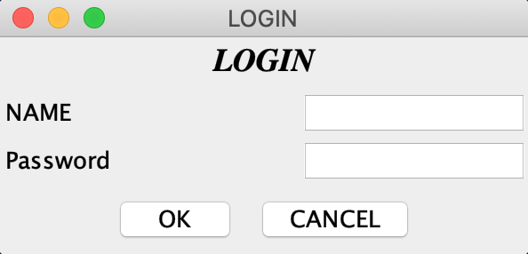
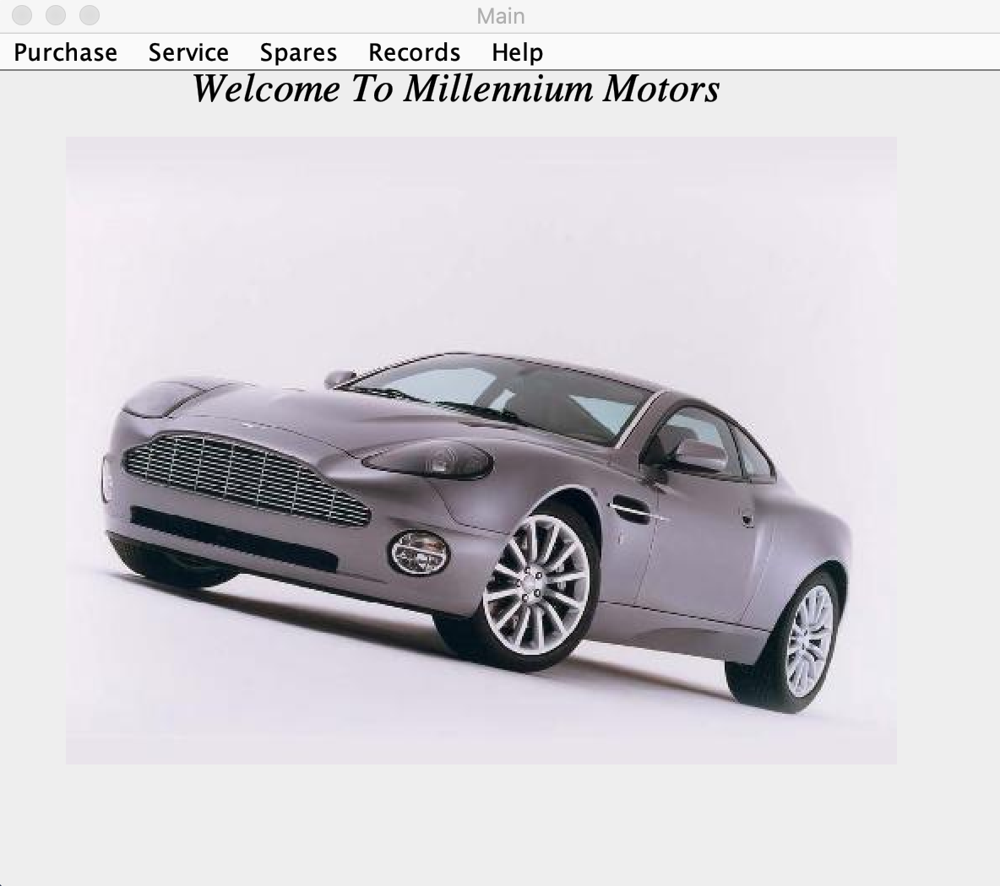
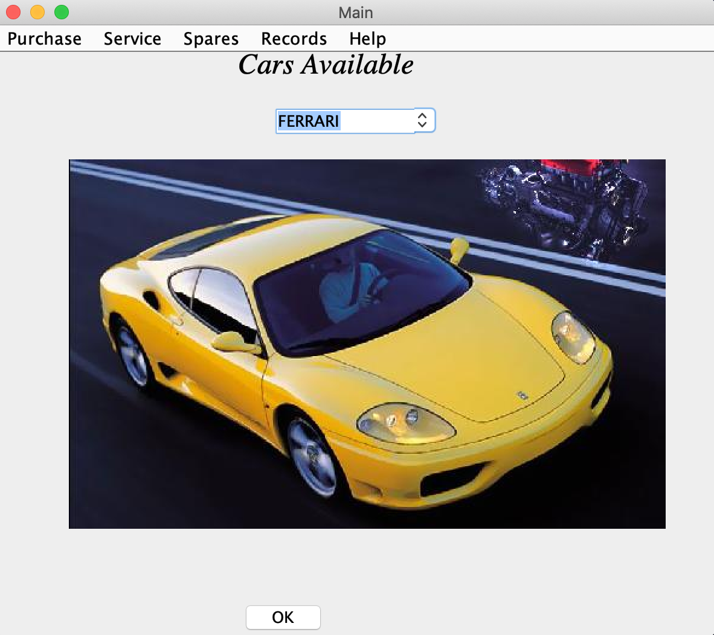
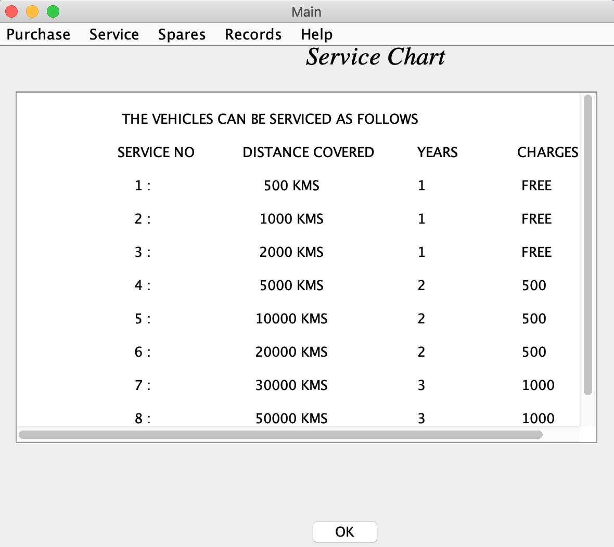
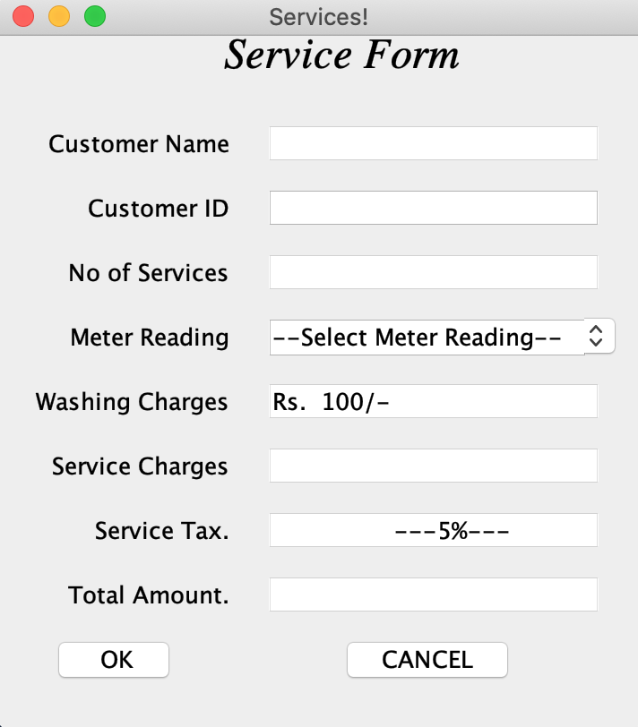
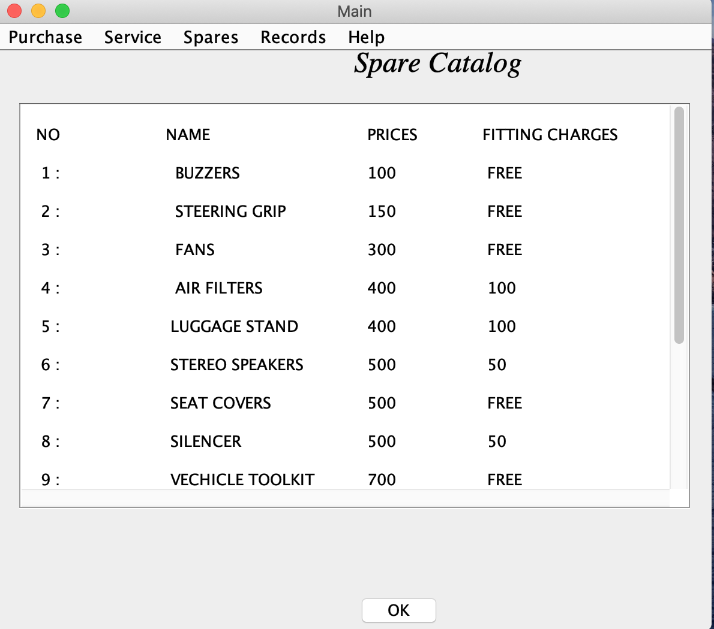
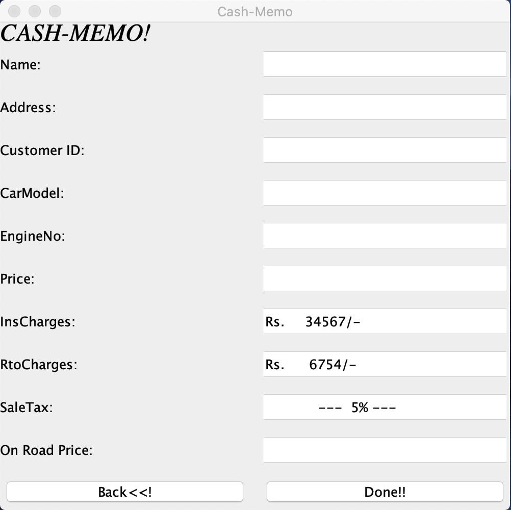
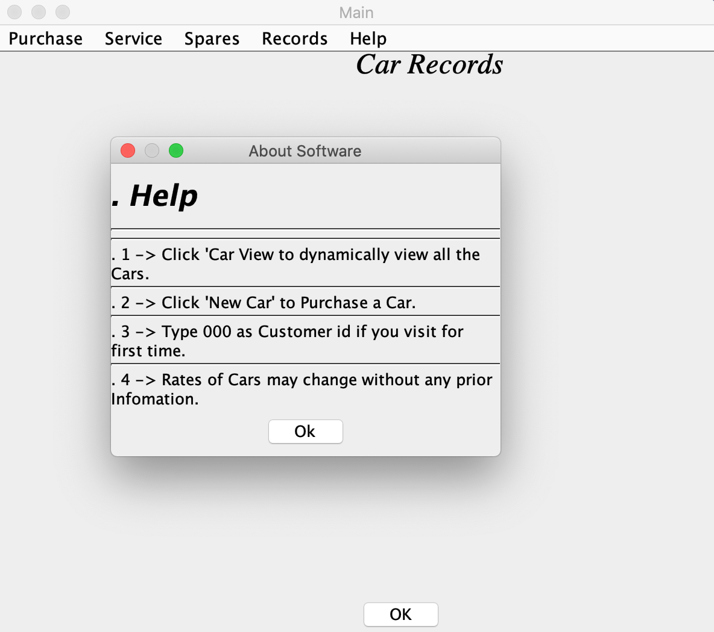

# Benz Car Showroom Application (2004)

Benz Car Showroom was the first Java Project with Swing UI developed in 2004 as part of academic work.

## Requirements
- JDK 1.2.
- Oracle 8
- [Configure ODBC Driver](https://www.catbase.com/configuring-an-odbc-driver)
- JCreator 1.10

## Screen Shots

### Login

   

### Home Screen

   

### Cars View

   

### Service Chart

   

### Service Form

   

### Spare Catalog

   

### Cash Memo

   

### Help

   
